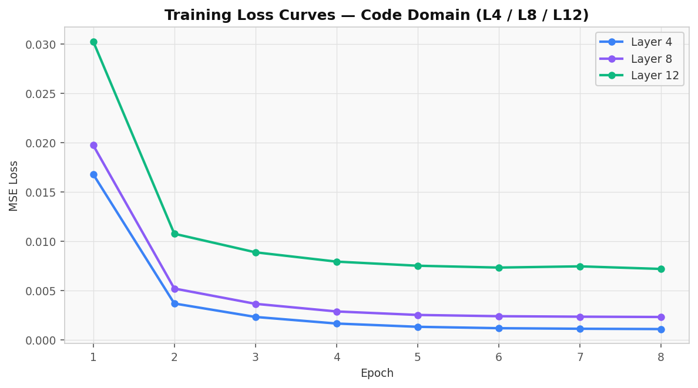
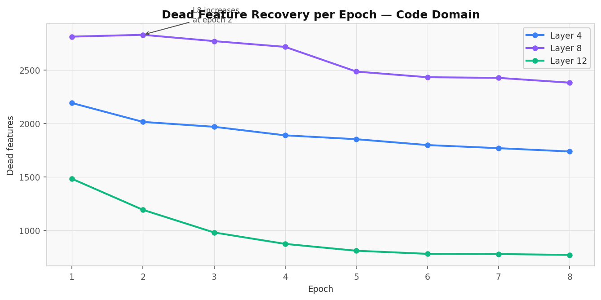
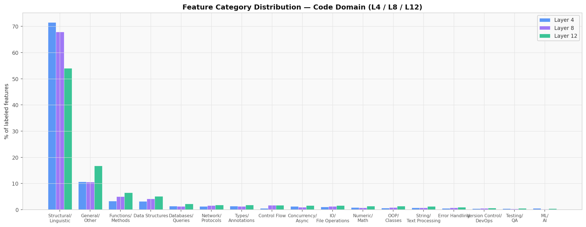
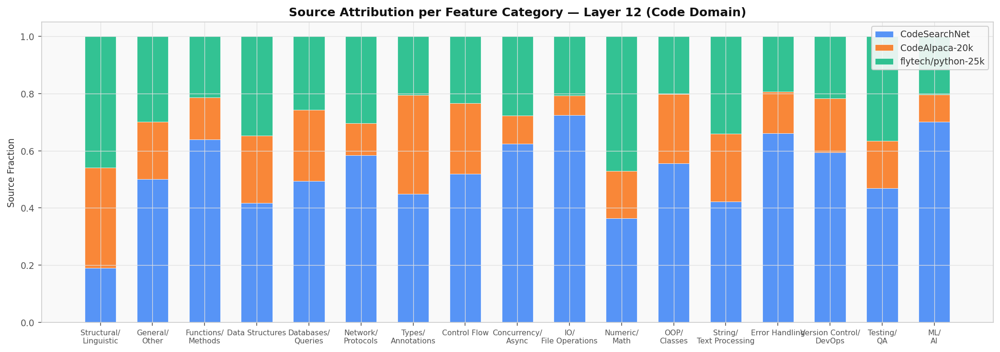
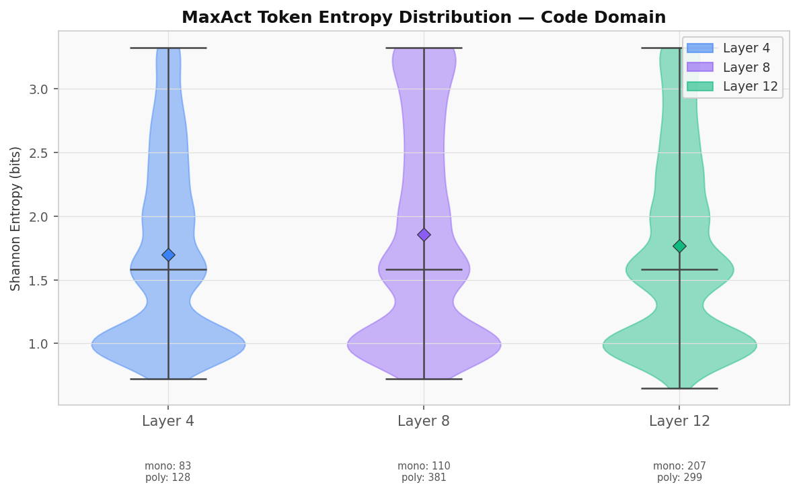

# SAE Interpretability Lab

A mechanistic interpretability tool for **Llama 3.2 1B-Instruct**. Trains a **BatchTopK Sparse Autoencoder (SAE)** on residual stream activations across two domains — **biomedical text** and **Python code** — decomposing internal representations into 8,192 interpretable features per layer, and exposing them through an interactive web UI. Chat with the model while observing exactly which features activate, steer outputs by amplifying or suppressing specific concepts, and compare how feature geometry differs across domains.

---

## Pipeline Overview

<p align="center">
  
</p>

**Three stages:**

1. **Collect** — stream ~500k instruction-formatted texts (medical Q&A or Python code) through Llama 3.2 1B, saving residual stream activations at layers 4, 8, and/or 12
2. **Train** — fit a BatchTopK SAE (K=64, 4× expansion → 8,192 features) on the saved activations; analyze features via MaxAct + VocabProj + TokenChange
3. **Label & Serve** — auto-label features with heuristics + GPT-4o-mini, then launch the FastAPI + vanilla JS web UI

---

## Cross-Domain Design

The same SAE architecture is applied identically to two domains, enabling direct comparison of how Llama 3.2 1B organizes representations across very different knowledge types.

### Data Sources

**Biomedical** (~150k samples each):
| Source | Description |
|---|---|
| MedMCQA / MedQA-USMLE | Multiple-choice clinical Q&A |
| PubMed QA | Biomedical questions with long-form answers |
| PubMed Abstracts | Summarization instructions from abstracts |

**Code** (~150k samples each):
| Source | Description |
|---|---|
| code_search_net (Python) | Docstring → function body pairs |
| CodeAlpaca-20k | Instruction → Python code pairs |
| flytech/python-codes-25k | Instruction → Python code pairs |

All examples are wrapped in the Llama 3.2 instruct chat template. This matters: SAEs trained on plain prose learn worse, less-generalizing features (FAST paper, arXiv:2506.07691).

### Cross-Domain Results Summary

| Domain | Layer | Dead Features | Explained Variance | Final Loss |
|---|---|---|---|---|
| Medical | 4 | 1,372 | 41.4% | 0.00132 |
| Code | 4 | 1,689 | 38.2% | 0.00123 |
| Medical | 8 | 3,861 | 41.6% | 0.00243 |
| Code | 8 | 2,297 | 40.0% | 0.00224 |
| Medical | 12 | 1,264 | 47.2% | 0.00766 |
| Code | 12 | 720 | 46.5% | 0.00687 |

Layer 12 yields the best reconstruction for both domains. The code SAE at L12 has notably fewer dead features (720 vs 1,264) despite similar explained variance, suggesting that code representations are more uniformly distributed across the feature dictionary. Medical L8 shows dramatically more dead features than code L8, consistent with medical text having sparser, more specialized mid-layer representations.

Feature categories differ sharply between domains. Medical features cluster around Clinical/Diagnostic, Pharmacology, and Research Methodology; code features cluster around Control Flow, Functions/Methods, Data Structures, and Types/Annotations — confirming the SAE recovers domain-appropriate structure.

---

## UI Showcase

### Chat with Live Feature Attribution

Ask any question and see which SAE features activate on both your input and the model's response, with token-level highlighting.

<p align="center">
  
</p>

### Feature Steering

Select features from the browser, set a strength (−50 to +50), and compare baseline vs. steered generation side by side.

<p align="center">
  
</p>

### Circuit Explorer

Enter any text and get a Sankey diagram showing which tokens activate which features.

<p align="center">
  
</p>

### Feature Browser

Browse and search all 3,000+ labeled features. Each card shows activation frequency, max activation, GPT-4o-mini label, MaxAct examples, and TokenChange analysis.

<p align="center">
  
</p>

---

## Installation

```bash
git clone <repo>
cd Capstone
python -m venv venv
source venv/bin/activate       # Windows: venv\Scripts\activate
pip install -r requirements.txt
```

Copy `.env.example` to `.env` and add your OpenAI key (only needed for semantic labeling):

```
OPENAI_API_KEY=sk-...
```

---

## Usage

### Full Pipeline

```bash
# Train on code domain (default), layer 12
python main.py

# Train on medical domain
python main.py --domain medical

# Train SAEs on layers 4, 8, and 12 simultaneously
python main.py --layers 4 8 12

# Quick smoke test (500 samples, 1 epoch)
python main.py --quick

# Re-train SAE only, reuse cached activations
python main.py --skip-collection
```

### Feature Labeling

```bash
# Heuristic labels (free, no API)
python label_features.py --heuristic-only

# Full labeling: heuristics + GPT-4o-mini
python label_features.py

# Label a specific domain and layer
python label_features.py --domain code --layer 12

# Preview candidates without API calls
python label_features.py --dry-run
```

### Web UI

```bash
python server.py                  # http://localhost:8000
python server.py --layer 8        # Serve a specific layer
```

### Typical Full Run

```bash
# Train both domains (~8 hours each on M1 Mac)
python main.py --domain medical --layers 4 8 12
python main.py --domain code --layers 4 8 12

# Label features ($2–4 in API costs per domain)
python label_features.py --domain medical --layer 12
python label_features.py --domain code --layer 12

# Serve
python server.py --layer 12
```

---

## Training Results

### Loss Curves (Layers 4 / 8 / 12)

All SAEs converge cleanly across both domains. Layer 12 starts higher (more complex representations) but plateaus within 8 epochs.

<p align="center">
  
</p>

<p align="center">
  
</p>

### Dead Feature Progression

<p align="center">
  
</p>

<p align="center">
  
</p>

### Feature Category Distributions

Medical features organize around clinical and research categories; code features organize around syntactic and semantic code structure.

<p align="center">
  
</p>

<p align="center">
  
</p>

### MaxAct Token Entropy

Shannon entropy of each feature's MaxAct token distribution — lower entropy = more monosemantic (fewer token types activate the feature). Layer 4 features are most monosemantic in both domains; Layer 8 is most polysemantic.

<p align="center">
  
</p>

<p align="center">
  
</p>

### Cross-Layer Feature Similarity

Features are largely layer-specific. Only ~11% of L4 features have a close match in L12 (cosine sim > 0.7), consistent with incremental representational refinement across layers.

<p align="center">
  
</p>

---

## SAE Architecture

**BatchTopK** (Bussmann et al. 2024 + Gao et al. 2024): selects the top `batch_size × K` activations across the whole batch rather than per-sample. This gives variable sparsity per example and more gradient signal to each feature, reducing dead features compared to standard TopK.

```
x  →  subtract b_pre  →  encoder (2048→8192)  →  BatchTopK (K=64)
   →  decoder (8192→2048)  →  add b_pre  →  x̂

Loss = MSE(x̂, x)  +  (1/32) × MSE(decoder(aux_hidden), residual)
```

| Hyperparameter | Value |
|---|---|
| Model | Llama 3.2 1B-Instruct |
| Layers trained | 4, 8, 12 |
| d\_model | 2048 |
| d\_hidden (features) | 8,192 |
| K (TopK) | 64 |
| Aux K | 256 |
| Aux coefficient | 1/32 |
| Epochs | 8 |
| Batch size | 4096 tokens |
| Learning rate | 1e-4 (cosine decay) |
| Training tokens | ~500k per domain |

---

## Feature Analysis Methods

Three complementary methods run for every feature after training:

| Method | Direction | Description |
|---|---|---|
| **MaxAct** | Input-centric | Top-20 tokens that most strongly activate the feature, sampled across quantiles |
| **VocabProj** | Output-centric | Decoder column projected onto the unembedding matrix (mean-centered) |
| **TokenChange** | Causal | Inject decoder direction via hook; measure KL shift in next-token distribution |

---

## Output Artifacts

```
medical_outputs/          # or code_outputs/
├── sae.pt                    # Trained SAE weights
├── features.json             # MaxAct + VocabProj + TokenChange for all 8192 features
├── labeled_features.json     # Labels, confidence, reasoning, category
├── training_history.json     # Loss + dead features + entropy per epoch
├── summary.json              # dead_features, avg_l0, explained_variance, final_loss
├── token_ids.pt              # All token IDs [n_tokens]
├── source_ids.pt             # Source attribution per token
├── activations.json          # Chunk file manifest
└── chunks/
    └── chunk_N.pt            # float16 activation chunks

# Multi-layer runs:
<domain>_outputs/layer_4/
<domain>_outputs/layer_8/
<domain>_outputs/layer_12/
<domain>_outputs/cross_layer_analysis.json
```

---

## Project Structure

```
├── config.py              # All hyperparameters + SparseAutoencoder class
├── main.py                # Full pipeline: collect → train → analyze → save
├── dataset.py             # Data streaming: medical (3 sources) + code (3 sources)
├── label_features.py      # Heuristic + GPT-4o-mini feature labeling
├── analyze_outputs.py     # Cross-domain analysis + comparison
├── server.py              # FastAPI backend + SSE streaming
├── src/
│   ├── index.html
│   ├── scripts/
│   │   ├── app.js         # Entry point, tab switching, health polling
│   │   ├── chat.js        # SSE token streaming, attribution panels
│   │   ├── attribution.js # Token highlighting + feature chips
│   │   ├── features.js    # Paginated feature browser
│   │   ├── steering.js    # Feature search + sliders + generation
│   │   └── explore.js     # Circuit explorer (D3 Sankey)
│   └── styles/
│       └── main.css
└── visualizations/
    ├── generate_plots.py
    ├── generate_code_plots.py
    ├── generate_comparison_figure.py
    ├── figures/            # Medical domain figures
    └── code_figures/       # Code domain figures
```

---

## Best Features for Steering

**Medical domain — high-confidence features with strong output shifts:**

| Index | Label | Max Act | Notes |
|---|---|---|---|
| 1071 | oxygen concentration descriptions | 11.4 | Pulls toward hypoxia, arterial pO₂ |
| 7656 | bone pathology descriptions | 11.9 | Strongest raw activation |
| 5028 | obesity classifications | 9.5 | High entropy — broad metabolic framing |
| 2311 | dietary fat content discussions | 9.4 | Pulls toward lipid profiles, fatty acids |
| 2351 | breast cancer terminology | 9.4 | Clear oncology steering |
| 846 | finger and hand anatomy | 10.0 | Strong anatomical framing |

**Recommended prompt for maximum steering effect:**
> *"What should a physician consider when a patient reports fatigue?"*

Run with feature 1071 at **+30** and feature 5028 at **+20** for a dramatic shift toward respiratory/metabolic framing.

---

## License

MIT — see [LICENSE](LICENSE).
