# Medical SAE Interpretability Lab

A mechanistic interpretability tool for **Llama 3.2 1B-Instruct**. Trains a **BatchTopK Sparse Autoencoder (SAE)** on residual stream activations from medical text, decomposes internal representations into 8,192 interpretable features, and exposes them through an interactive web UI — letting you chat with the model while observing exactly which features activate, and steer its outputs by amplifying or suppressing specific concepts.

---

## Pipeline Overview

<p align="center">
  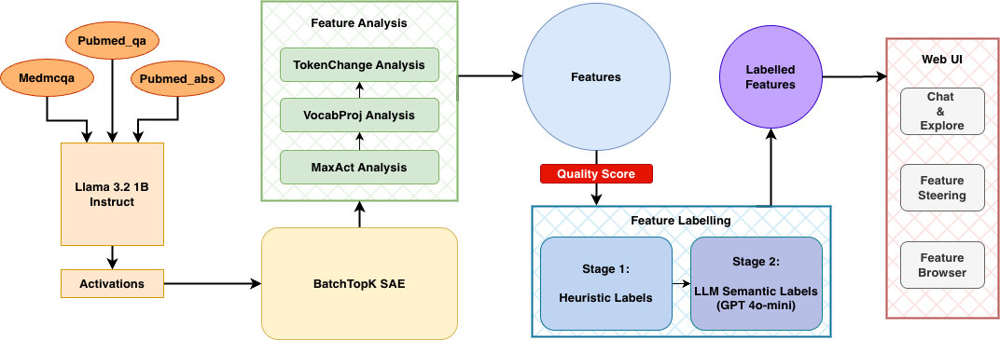
</p>

**Three stages:**

1. **Collect** — stream ~500k medical Q&A pairs (MedMCQA, PubMed QA, PubMed abstracts) through Llama 3.2 1B, saving residual stream activations at layers 4, 8, and/or 12
2. **Train** — fit a BatchTopK SAE (K=64, 4× expansion → 8,192 features) on the saved activations; analyze features via MaxAct + VocabProj + TokenChange
3. **Label & Serve** — auto-label features with heuristics + GPT-4o-mini, then launch the FastAPI + vanilla JS web UI

---

## UI Showcase

### Chat with Live Feature Attribution

Ask any medical question and see which SAE features activate on both your input and the model's response, with token-level highlighting.

<p align="center">
  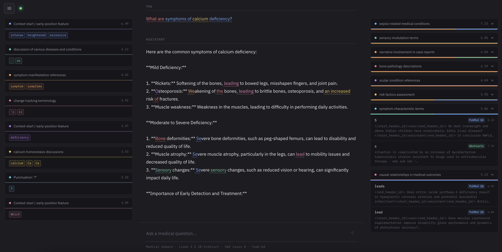
</p>

### Feature Steering

Select features from the browser, set a strength (−50 to +50), and compare baseline vs. steered generation side by side. The oxygen concentration feature (idx 1071) shown here noticeably pulls generation toward hypoxia and respiratory framing.

<p align="center">
  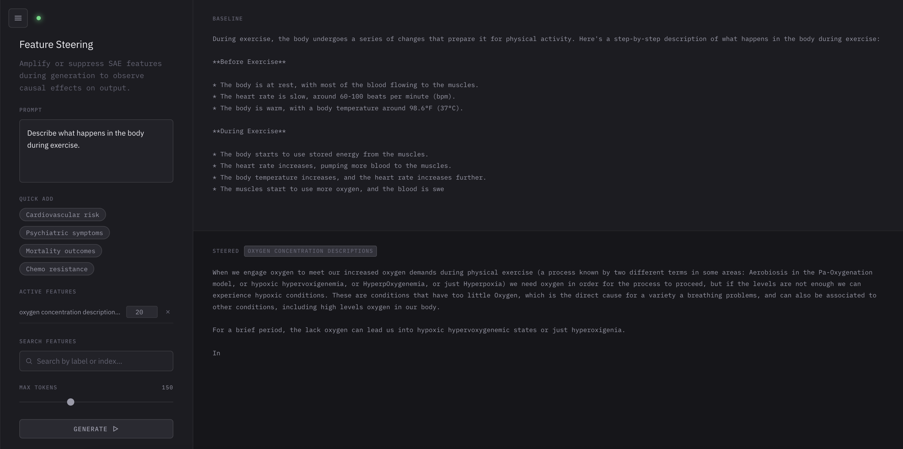
</p>

### Circuit Explorer

Enter any text and get a Sankey diagram showing which tokens activate which features — tracing the model's computational circuit for that input.

<p align="center">
  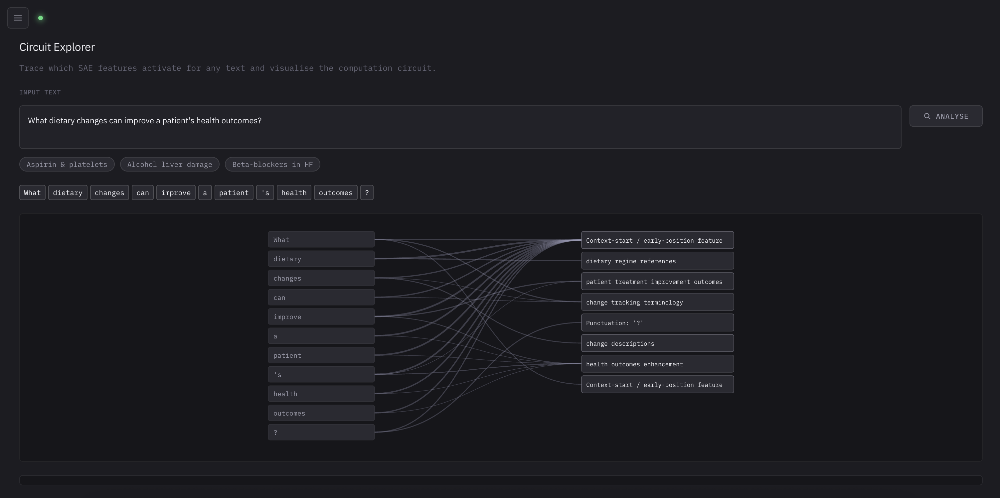
</p>

### Feature Browser

Browse and search all 3,000+ labeled features. Each feature card shows activation frequency, max activation, GPT-4o-mini label, MaxAct examples, and TokenChange analysis.

<p align="center">
  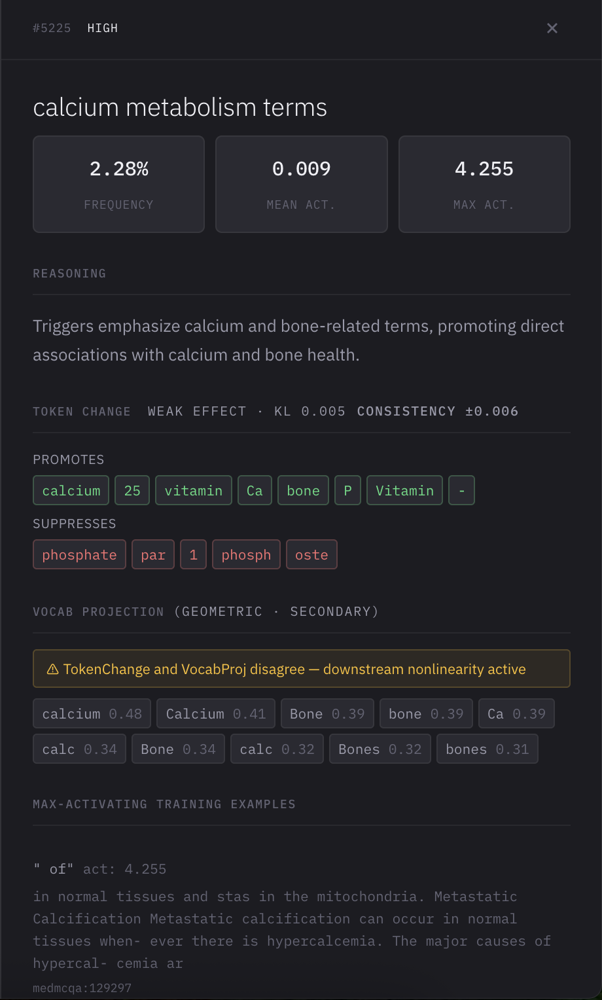
</p>

---

## Installation

```bash
git clone <repo>
cd Capstone
python -m venv venv
source venv/bin/activate       # Windows: venv\Scripts\activate
pip install -r requirements.txt
```

Copy `.env.example` to `.env` and add your OpenAI key (only needed for semantic labeling):

```
OPENAI_API_KEY=sk-...
```

---

## Usage

### Full Pipeline

```bash
# Train on layer 12 (default)
python main.py

# Train SAEs on layers 4, 8, and 12 simultaneously + cross-layer analysis
python main.py --layers 4 8 12

# Quick smoke test (500 samples, 1 epoch)
python main.py --quick

# Re-train SAE only, reuse cached activations
python main.py --skip-collection
```

### Feature Labeling

```bash
# Heuristic labels (free, no API)
python label_features.py --heuristic-only

# Full labeling: heuristics + GPT-4o-mini
python label_features.py

# Label a specific layer's features
python label_features.py --layer 8

# Preview candidates without API calls
python label_features.py --dry-run
```

### Web UI

```bash
python server.py                  # http://localhost:8000
python server.py --layer 8        # Serve a specific layer
```

---

## Training Results

### Loss Curves (Layers 4 / 8 / 12)

All three SAEs converge cleanly. Layer 12 starts higher (more complex representations) but plateaus within 8 epochs.

<p align="center">
  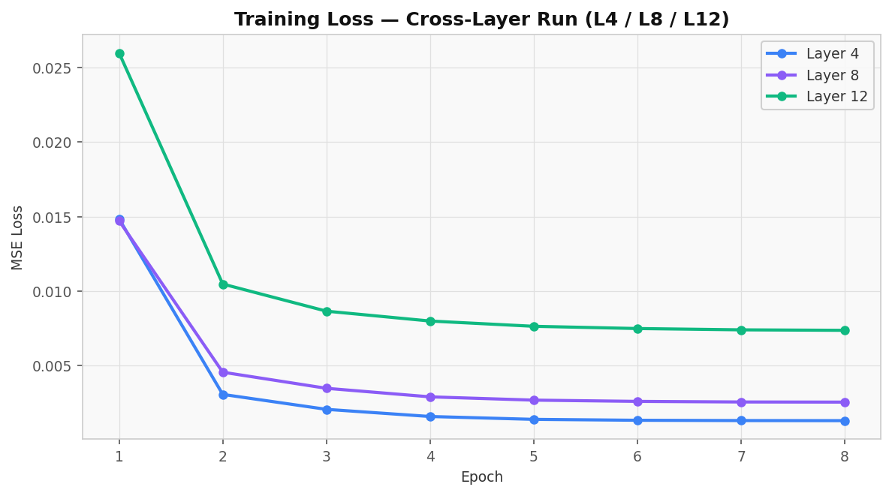
</p>

### Dead Feature Progression

<p align="center">
  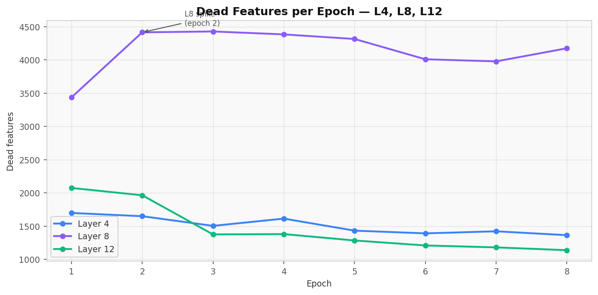
</p>

### Feature Sparsity

<p align="center">
  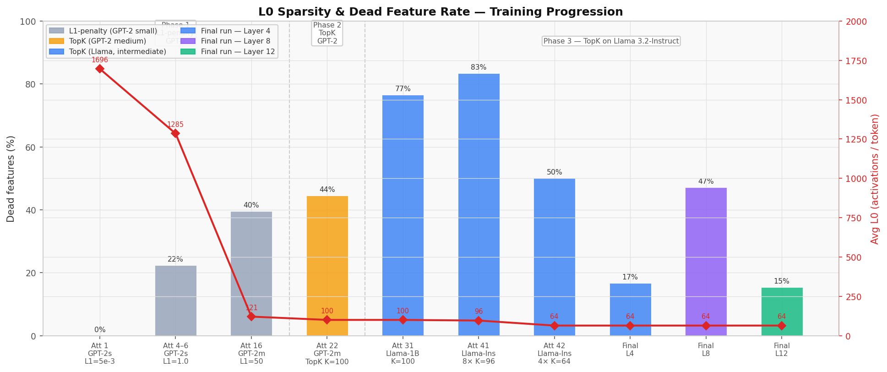
</p>

---

## Feature Analysis

### MaxAct Token Entropy by Layer

Shannon entropy of each feature's MaxAct token distribution — lower entropy = more monosemantic. Layer 4 features are the most monosemantic (tight token clusters); Layer 8 is the most polysemantic.

<p align="center">
  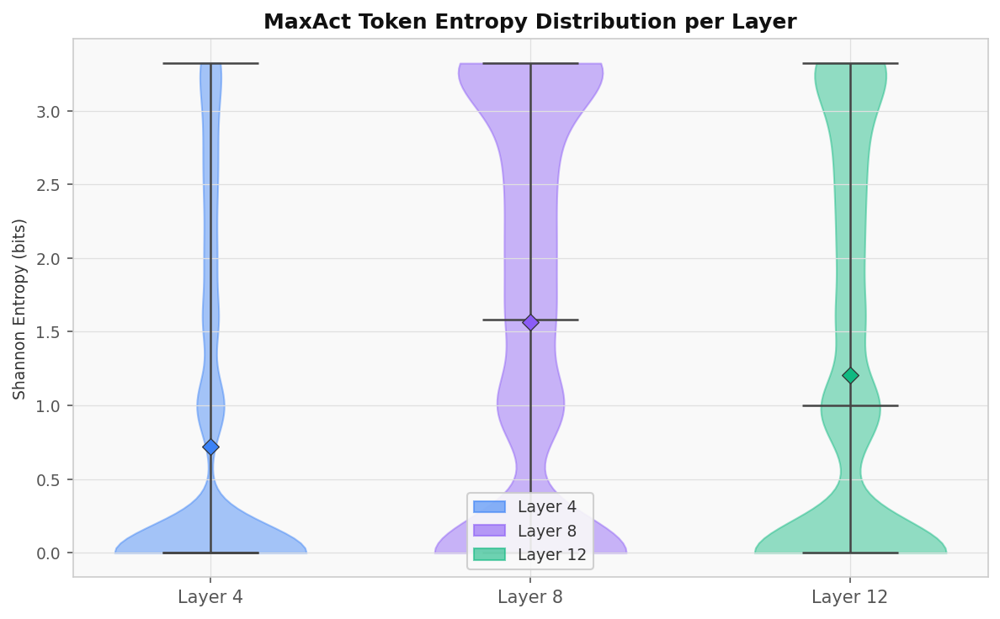
</p>

### Cross-Layer Feature Similarity

Features are largely layer-specific. Only ~11% of L4 features have a close match in L12 (cosine sim > 0.7), while L4↔L8 and L8↔L12 share more (~11–32%), consistent with incremental representational refinement.

<p align="center">
  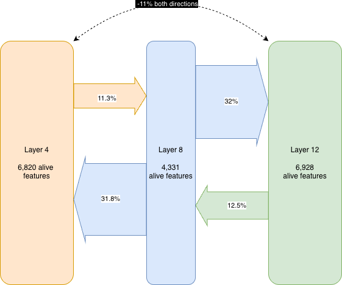
</p>

<p align="center">
  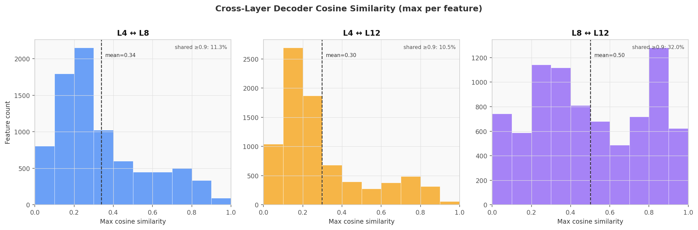
</p>

### Source Attribution by Category

<p align="center">
  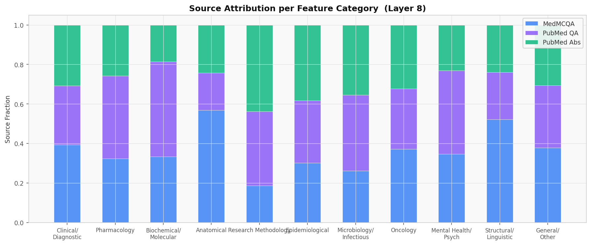
</p>

<p align="center">
  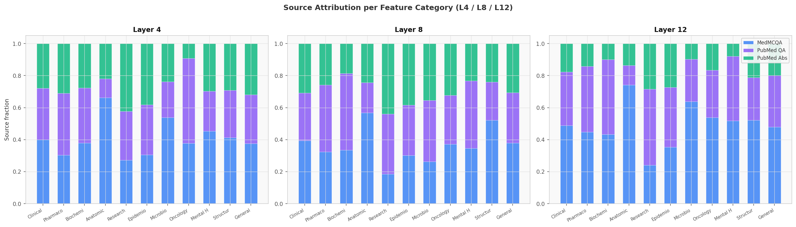
</p>

---

## SAE Architecture

**BatchTopK** (Bussmann et al. 2024 + Gao et al. 2024): selects the top `batch_size × K` activations across the whole batch rather than per-sample. This gives variable sparsity per example and more gradient signal to each feature, reducing dead features compared to standard TopK.

```
x  →  subtract b_pre  →  encoder (2048→8192)  →  BatchTopK (K=64)
   →  decoder (8192→2048)  →  add b_pre  →  x̂

Loss = MSE(x̂, x)  +  (1/32) × MSE(decoder(aux_hidden), residual)
```

| Hyperparameter | Value |
|---|---|
| Model | Llama 3.2 1B-Instruct |
| Layers trained | 4, 8, 12 |
| d\_model | 2048 |
| d\_hidden (features) | 8,192 |
| K (TopK) | 64 |
| Aux K | 256 |
| Aux coefficient | 1/32 |
| Epochs | 8 |
| Batch size | 4096 tokens |
| Learning rate | 1e-4 (cosine decay) |
| Training tokens | ~500k |

---

## Feature Analysis Methods

Three complementary methods are run for every feature after training:

| Method | Direction | Description |
|---|---|---|
| **MaxAct** | Input-centric | Top-20 tokens that most strongly activate the feature, sampled across quantiles |
| **VocabProj** | Output-centric | Decoder column projected onto the unembedding matrix (mean-centered) |
| **TokenChange** | Causal | Inject decoder direction via hook; measure KL shift in next-token distribution |

---

## Output Artifacts

```
medical_outputs/
├── sae.pt                    # Trained SAE weights
├── features.json             # MaxAct + VocabProj + TokenChange for all 8192 features
├── labeled_features.json     # Labels, confidence, reasoning, category
├── training_history.json     # Loss + dead features + entropy per epoch
├── summary.json              # dead_features, avg_l0, explained_variance, final_loss
├── token_ids.pt              # All token IDs [n_tokens]
├── source_ids.pt             # Source attribution per token
├── activations.json          # Chunk file manifest
└── chunks/
    └── chunk_N.pt            # float16 activation chunks

# Multi-layer runs:
medical_outputs/layer_4/      # Same structure per layer
medical_outputs/layer_8/
medical_outputs/layer_12/
medical_outputs/cross_layer_analysis.json
```

---

## Project Structure

```
├── config.py              # All hyperparameters + SparseAutoencoder class
├── main.py                # Full pipeline: collect → train → analyze → save
├── dataset.py             # Medical data streaming (3 sources, chat-formatted)
├── label_features.py      # Heuristic + GPT-4o-mini feature labeling
├── server.py              # FastAPI backend + SSE streaming
├── src/
│   ├── index.html
│   ├── scripts/
│   │   ├── app.js         # Entry point, tab switching, health polling
│   │   ├── chat.js        # SSE token streaming, attribution panels
│   │   ├── attribution.js # Token highlighting + feature chips
│   │   ├── features.js    # Paginated feature browser
│   │   ├── steering.js    # Feature search + sliders + generation
│   │   └── explore.js     # Circuit explorer (D3 Sankey)
│   └── styles/
│       └── main.css
└── visualizations/
    ├── generate_plots.py
    └── figures/
```

---

## Best Features for Steering

High-confidence features with strong activations that produce clear output shifts:

| Index | Label | Max Act | Notes |
|---|---|---|---|
| 1071 | oxygen concentration descriptions | 11.4 | Broad; pulls toward hypoxia, arterial pO₂ |
| 7656 | bone pathology descriptions | 11.9 | Strongest raw activation |
| 5028 | obesity classifications | 9.5 | High entropy — broad metabolic framing |
| 2311 | dietary fat content discussions | 9.4 | Pulls toward lipid profiles, fatty acids |
| 2351 | breast cancer terminology | 9.4 | Clear oncology steering |
| 846 | finger and hand anatomy | 10.0 | Strong + broad anatomical framing |

**Recommended prompt for maximum steering effect:**
> *"What should a physician consider when a patient reports fatigue?"*

Run with feature 1071 at **+30** and feature 5028 at **+20** for a dramatic shift toward respiratory/metabolic framing.